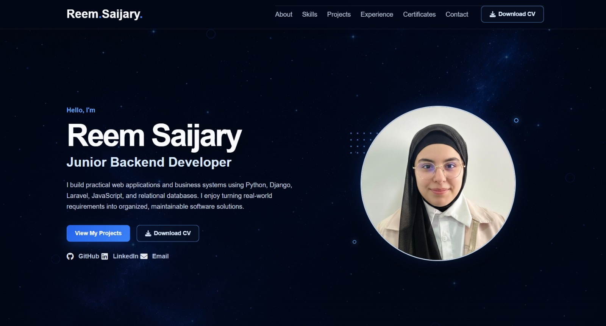

<h1 align="center">Reem Saijary — Portfolio Website</h1>

<p align="center">
  A responsive personal portfolio website showcasing my projects, technical skills,
  professional experience, education, and certifications.
</p>

<p align="center">
  
  
  
  
</p>

<p align="center">
  <a href="https://reemsaijary.github.io/reem-portfolio-website/">
    
  </a>
</p>

---

## About the Portfolio

This portfolio was developed as part of my virtual internship at **Codveda Technologies** and serves as a central place where recruiters, collaborators, and potential clients can learn more about my work as a Junior Backend Developer.

The website presents my background as a Computer Science graduate and highlights my experience building practical, database-driven web applications and business systems using technologies such as Python, Django, Laravel, JavaScript, MySQL, PostgreSQL, and SQLite.

## Preview

<p align="center">
  <a href="https://reemsaijary.github.io/reem-portfolio-website/">
    
  </a>
</p>

## Main Sections

- Home
- About Me
- Skills and Technologies
- Projects
- Professional Experience
- Education and Certifications
- Contact

## Featured Projects

### Recruitment CRM Platform

A role-based recruitment management system developed using Django.

Main features include:

- Admin, company, and candidate dashboards
- Job and application management
- Candidate profiles and CV uploads
- Interview scheduling
- Application status tracking
- Notifications
- Google authentication
- Responsive user interface
- Cloud deployment

### Mini ERP Factory Management System

A factory management system developed using Laravel and MySQL.

The system helps organize:

- Employees
- Production workflows
- Attendance
- Salaries
- Administrative operations
- User roles and permissions

### Hallal Snack Website

A responsive restaurant website created to present menu items, promotions, contact information, and the restaurant’s services through a clear and accessible interface.

## Technologies Used

### Frontend

- HTML5
- CSS3
- JavaScript
- Font Awesome
- Responsive Web Design

### Development Tools

- Git
- GitHub
- Visual Studio Code

## Project Structure

```text

portfolio/
├── assets/
│   ├── certificates/
│   ├── fonts/
│   ├── icons/
│   ├── images/
│   └── resume/
├── css/
│   ├── components.css
│   ├── layout.css
│   ├── reset.css
│   ├── responsive.css
│   ├── style.css
│   └── variables.css
├── js/
│   ├── data.js
│   └── main.js
├── development-plan.md
├── index.html
└── README.md 
```

## Key Features

- Responsive layout for desktop, tablet, and mobile devices
- Semantic HTML structure
- Reusable CSS components
- Organized CSS architecture
- Mobile navigation menu
- Sticky navigation header
- Downloadable CV
- Interactive certificate viewer
- Accessible keyboard controls
- Dynamic footer year
- Custom favicon
- External GitHub and LinkedIn links
- Email contact links

---

## Accessibility

The website includes several accessibility considerations:

- Semantic HTML elements
- Descriptive alternative text for images
- Keyboard-accessible controls
- Visible focus styles
- ARIA attributes for the navigation menu and certificate modal
- Reduced-motion support
- Appropriate color contrast

---

## Running the Project Locally

### 1. Clone the repository

```bash
git clone https://github.com/reemsaijary/reem-portfolio-website.git
```

### 2. Open the project folder

```bash
cd reem-portfolio-website
```

### 3. Run the project

Open `index.html` directly in your browser or run it using the **Live Server** extension in Visual Studio Code.

> No package installation or build process is required.

---

## Development Process

The website was developed incrementally using a structured development plan.

The development process included:

1. Planning the website structure and visual direction.
2. Creating the project folder architecture.
3. Developing reusable CSS variables and components.
4. Building each portfolio section.
5. Adding responsive layouts.
6. Implementing JavaScript interactions.
7. Testing accessibility and navigation.
8. Refining typography and visual consistency.
9. Adding personal branding and a custom favicon.
10. Preparing the website for deployment.

Detailed progress is documented in [`development-plan.md`](development-plan.md).

---

## Future Improvements

Possible future improvements include:

- Adding new projects and professional experience
- Adding a functional contact form connected to a backend or email service
- Adding individual project case-study pages
- Improving social-sharing metadata
- Adding automated performance testing

---

## Contact

**Reem Saijary**

Junior Backend Developer based in Lebanon.

- **GitHub:** [reemsaijary](https://github.com/reemsaijary)
- **LinkedIn:** [Reem Saijary](https://www.linkedin.com/in/reem-saijary)
- **Email:** <reemsaijary31@gmail.com>

---

## License

This project is created for personal portfolio and educational purposes.

© Reem Saijary